# ⚽ 2026 世界杯数据助手

> 一个基于 Elo 模型 + 机器学习 + Monte Carlo 模拟的世界杯赛事数据分析平台。

**在线地址：** [https://worldcup-predictor-production-2e12.up.railway.app](https://worldcup-predictor-production-2e12.up.railway.app)

---

## 📋 功能总览

| 页面 | 功能 | 截图 |
|------|------|------|
| `/` 首页 | 48 小时赛程概览 + 快捷入口 | [today_first_page.png](./assets/today_first_page.png) |
| `/schedule` 赛程 | 全部 104 场比赛时间表 | [match_schedule_page.png](./assets/match_schedule_page.png) |
| `/match/:t1/:t2` 比赛预测 | Elo 概率 + 比分分布 + 风险等级 | [match_detail_elo.png](./assets/match_detail_elo.png) |
| `/match/:t1/:t2` ML 预测 | 机器学习模型预测视角 | [match_detail_ml.png](./assets/match_detail_ml.png) |
| `/ai-analysis/:t1/:t2` AI 分析 | 大模型深度分析报告 | [ai-analysis-page.png](./assets/ai-analysis-page.png) |
| `/standings` 晋级概率 | 小组出线 + 夺冠概率榜 | [group_stage_standings_page.png](./assets/group_stage_standings_page.png) |
| `/opponent-matrix` 对手矩阵 | 淘汰赛潜在对手概率矩阵 | [opponent_matrix_page.png](./assets/opponent_matrix_page.png) |
| `/knockout` 淘汰赛 | 淘汰赛实时仪表盘 | [knockout_page.png](./assets/knockout_page.png) |
| `/bracket` 晋级树 | 48 队完整晋级树全景（SVG） | [knockout_simulator_page.png](./assets/knockout_simulator_page.png) |
| `/simulator` 模拟器 | 蒙特卡洛交互式模拟 | [simulator_page.png](./assets/simulator_page.png) |
| `/teams` 球队 | 48 支参赛队信息库 | [teams_information_page.png](./assets/teams_information_page.png) |
| `/backtest` 回测 | 模型历史回测报告 | [backtest_page.png](./assets/backtest_page.png) |
| `/blog` 分析文章 | 深度赛事分析文章 | [article_blog_page.png](./assets/article_blog_page.png) |
| `/polymarket` 预测市场 | Polymarket 链上赔率 | [polymarket_page.png](./assets/polymarket_page.png) |
| `/admin` 管理 | 系统状态监控 + 数据管理 | [admin_management_page.png](./assets/admin_management_page.png) |

---

## 🏠 首页 — 48 小时赛程

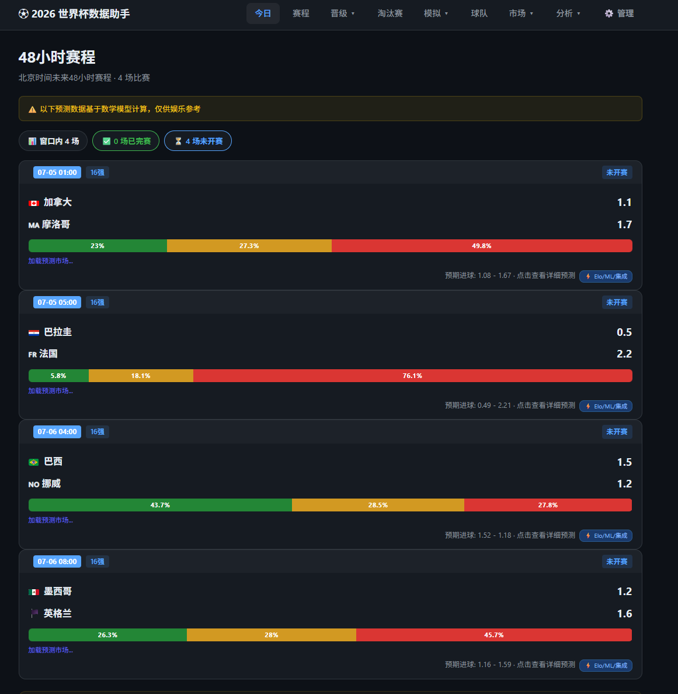

48 小时内所有比赛的浓缩视图，按时间线排列。显示每场比赛的 **Elo 预测胜率**、**预期进球（xG）** 和 **风险等级**。顶部提供三个快捷入口（完整赛程、晋级概率、球队信息）直达核心功能。

**关键特性：**
- 实时刷新比赛状态
- 支持排序和筛选
- 点击任意比赛进入详情预测页

---

## 📅 完整赛程

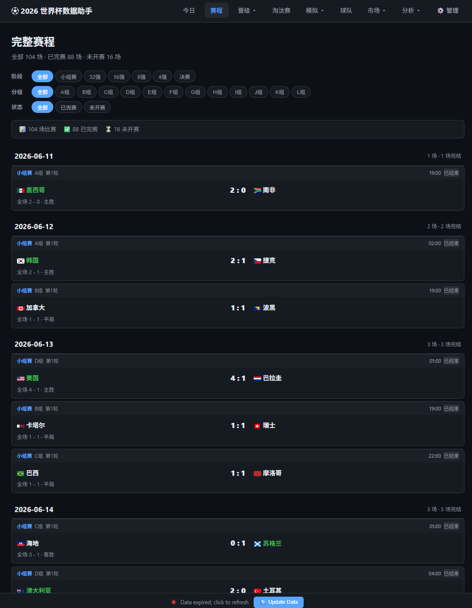

全部 104 场比赛的总览表，支持多维度筛选。

**筛选维度：**
- **阶段：** 全部 / 小组赛 / 32强 / 16强 / 8强 / 4强 / 决赛
- **分组：** A-L 组
- **状态：** 已完赛 / 未开赛

每个比赛行显示对阵双方、比赛时间、Elo 预测概率。

---

## 🎯 比赛详情预测 — Elo 视图

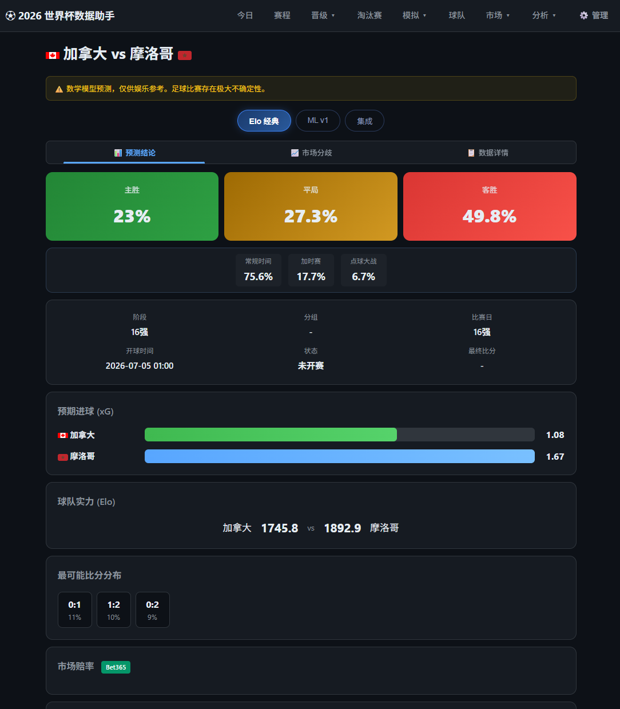

单场比赛的深度预测页，Elo 模型视图：

- **胜 / 平 / 负 概率条形图**
- **比分分布：** 最可能比分及其概率（基于 Poisson 分布）
- **风险等级：** 低/中/高 三档量化不确定性
- **双方数据对比：** Elo 评分、xG 期望进球

多张截图展示不同比赛的预测结果：

| 截图 | 说明 |
|------|------|
| [match_detail_elo.png](./assets/match_detail_elo.png) | Elo 预测主视图 |
| [match_detail_elo1.png](./assets/match_detail_elo1.png) | 另一场 Elo 预测示例 |
| [match_detail_elo3.png](./assets/match_detail_elo3.png) | 比分分布详情 |

**访问方式：** 点击首页/赛程页/淘汰赛页面的任意比赛，或直接访问 `/match/:t1/:t2`

---

## 🤖 比赛详情预测 — ML 模型视图

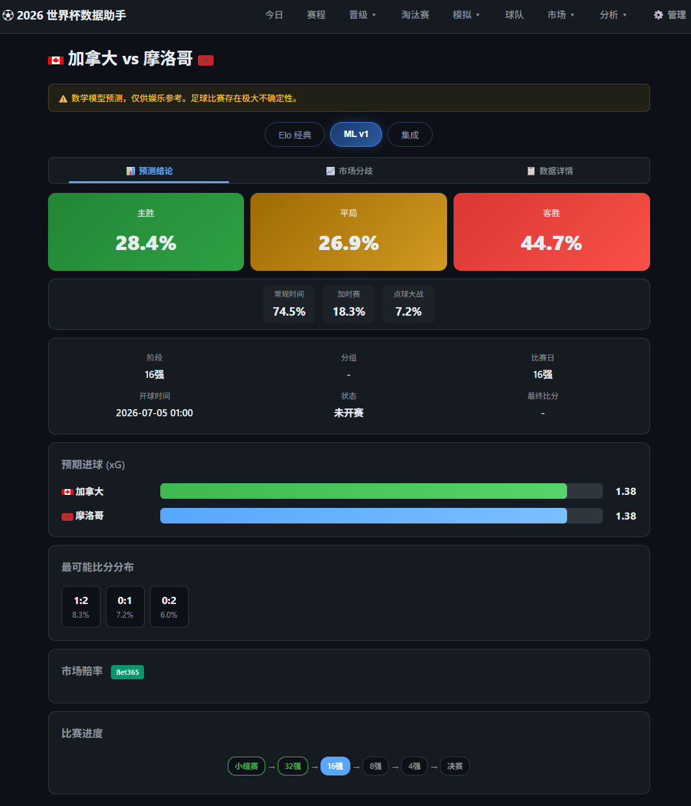

机器学习模型（XGBoost + Elo 集成）的预测视图：

| 截图 | 说明 |
|------|------|
| [match_detail_ml.png](./assets/match_detail_ml.png) | ML 预测主视图 |
| [match_detail_ml2.png](./assets/match_detail_ml2.png) | 另一场 ML 预测示例 |
| [match_detail_ml3.png](./assets/match_detail_ml3.png) | ML 模型输出详情 |

ML 模型与 Elo 模型进行集成融合，动态调整权重，提升预测准确率。

---

## 🧠 AI 分析报告

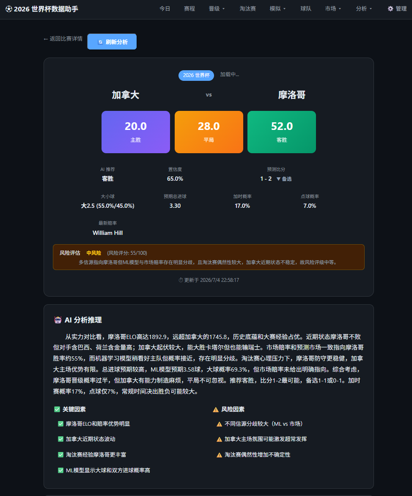

调用大语言模型（DeepSeek / Gemini）生成的 **全中文深度分析报告**，涵盖：

- 双方优劣势对比
- 关键球员对位分析
- 比赛走势预判
- 战术风格解读

**访问方式：** 在比赛详情页点击"AI 分析"标签，或直接访问 `/ai-analysis/:t1/:t2`

---

## 🏆 晋级概率榜

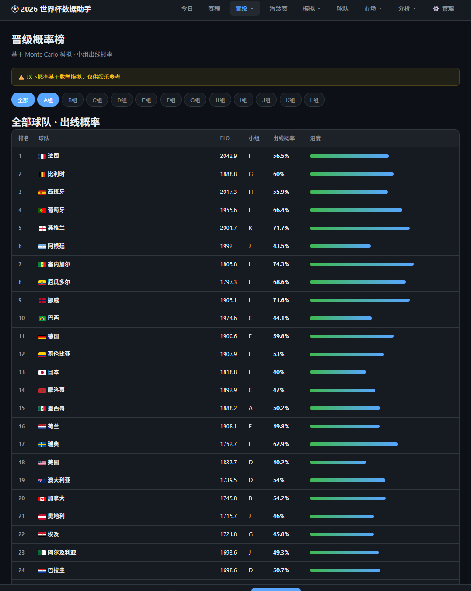

基于 Monte Carlo 模拟（10,000 次）的 48 支球队出线概率排名。支持按小组筛选，每行显示：

- 球队名 + 队旗
- Elo 评分
- 所在小组
- 出线概率（%）
- 概率进度条

淘汰赛阶段开始后自动切换为夺冠概率排行榜。

---

## 📊 对手矩阵

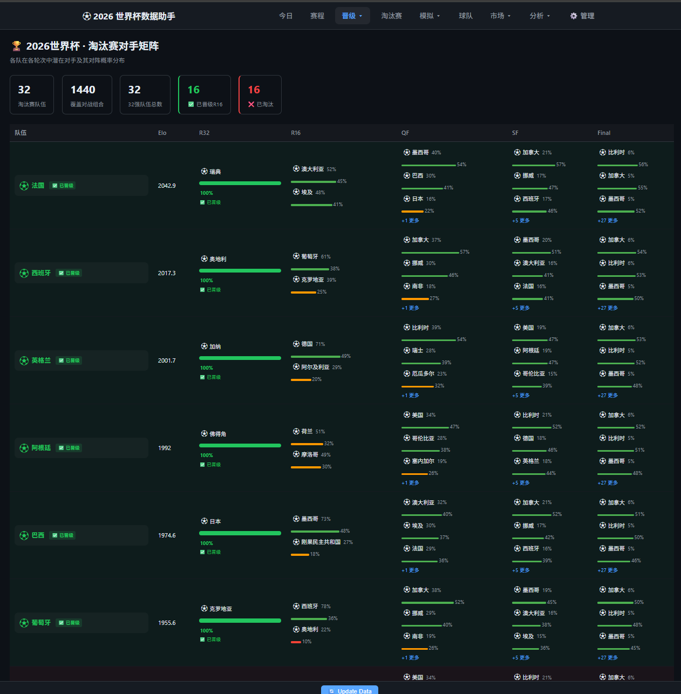

淘汰赛阶段的对手概率矩阵。行 = 球队，列 = 潜在对手，交叉单元格显示"某队在淘汰赛中遇到某队的概率"。帮助分析：

- 哪条晋级路线对某队最有利
- 哪些"死亡半区"正在形成
- 东道主是否会遇到最强对手

---

## 🗺️ 淘汰赛仪表盘

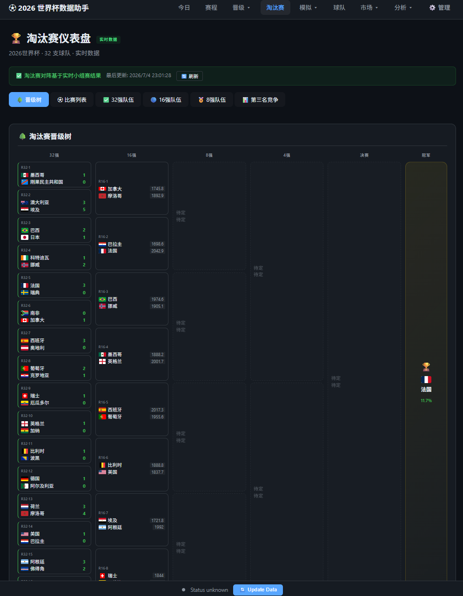

淘汰赛阶段的核心控制面板，包含 5 个 Tab：

- **比赛列表：** 所有淘汰赛场次列表，区分已完赛（R32）和待赛（R16 起）
- **晋级树：** 可视化 SVG 晋级树
- **16 强队伍：** 确定晋级的 16 支球队
- **8 强队伍：** 八强晋级概率
- **引擎对比：** Elo vs ML 预测对比

数据来源包括赛事官方 API 和 Monte Carlo 模拟推理。

---

## 🌳 晋级树全景

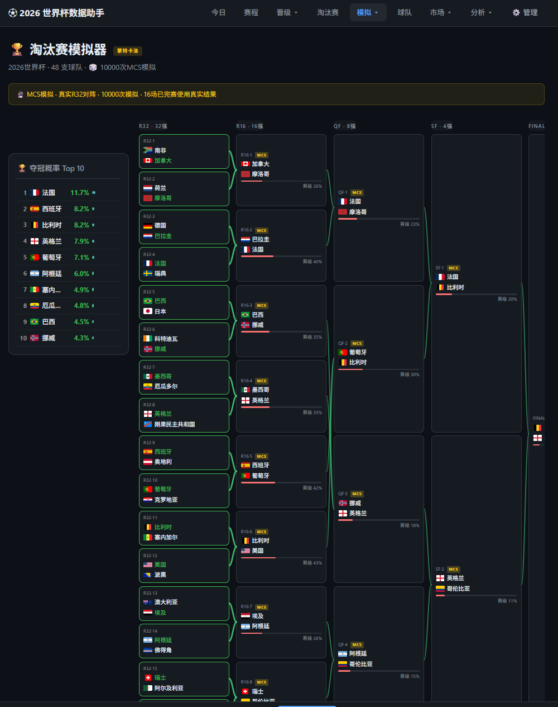

48 队完整晋级树的 SVG 可视化展示。显示：

- 小组赛出线队伍 → 32 强对阵
- 32 强 → 16 强 → 8 强 → 4 强 → 决赛
- 已完赛的晋级路径用实线高亮
- 预测路径用虚线表示

---

## 🎲 蒙特卡洛模拟

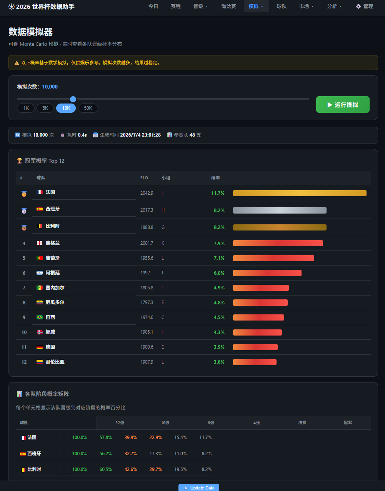

交互式模拟器，可自定义参数运行 Monte Carlo 模拟（默认 10,000 次）：

- **夺冠概率分布：** 各球队夺冠概率圆环图
- **半决赛 / 决赛预测：** 最可能对决组合
- **参数可调：** 根据场景调整模型权重
- **实时运行：** 后端 Python 推理引擎

---

## 🏴 球队信息库

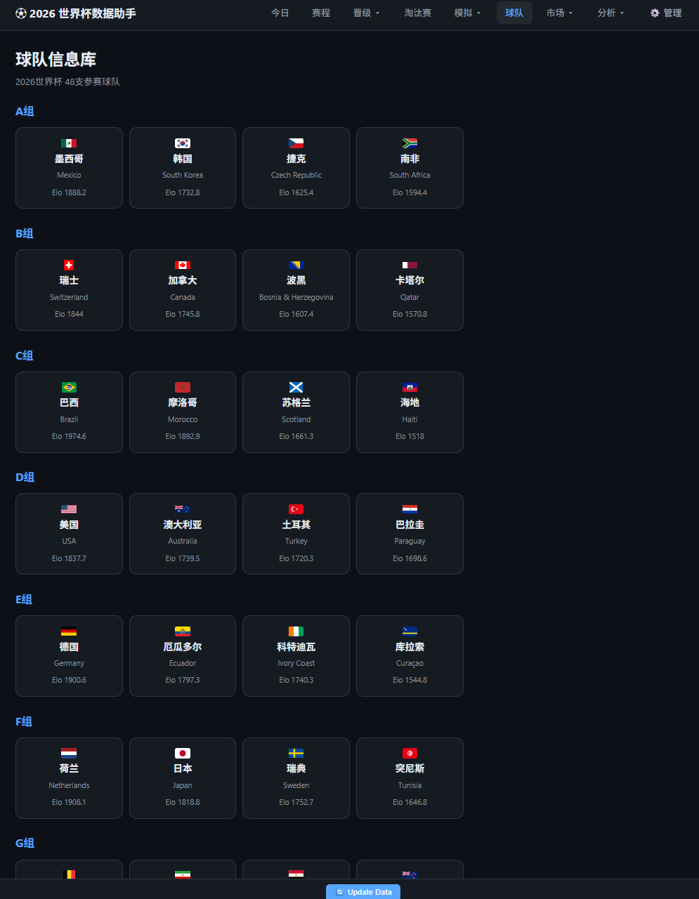

全部 48 支参赛队的信息总览，支持搜索和筛选。每支球队展示：

- 队旗 + 中文名
- Elo 评分
- 所在小组
- 小组赛 / 淘汰赛成绩

点击球队进入详情页，查看其比赛记录和晋级历程。

---

## 📈 模型回测

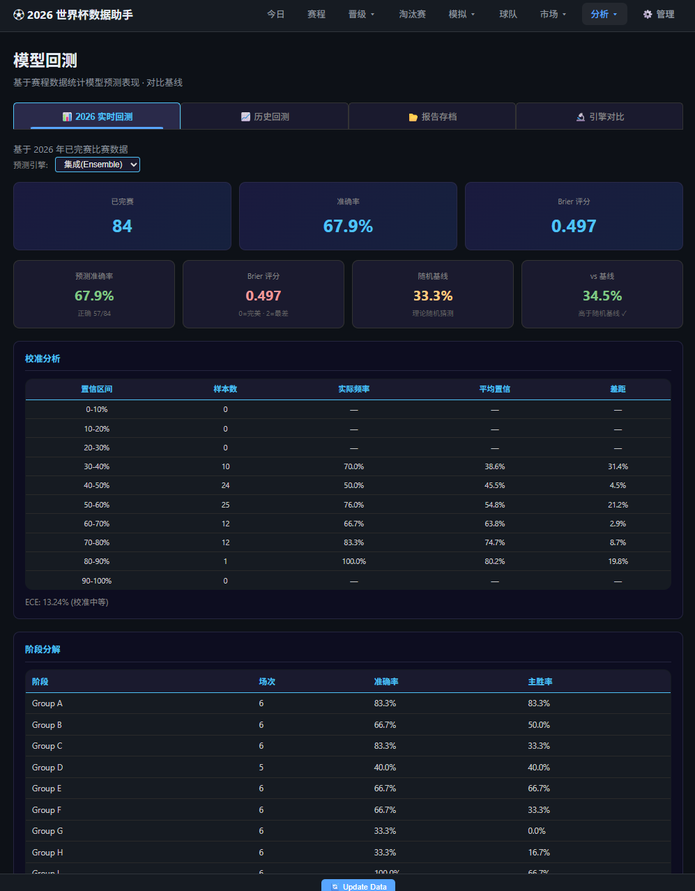

对预测模型进行历史数据的回测验证，量化模型表现：

- **总体准确率：** 历史比赛预测的命中率
- **按年份 / 阶段分拆：** 不同时间段的模型表现对比
- **误差分析：** 预测误差的正态分布
- **Elo vs ML 对比：** 两个模型各自的表现差异
- **报告存档：** 历史回测报告可查看和对比

---

## ✍️ 深度分析文章

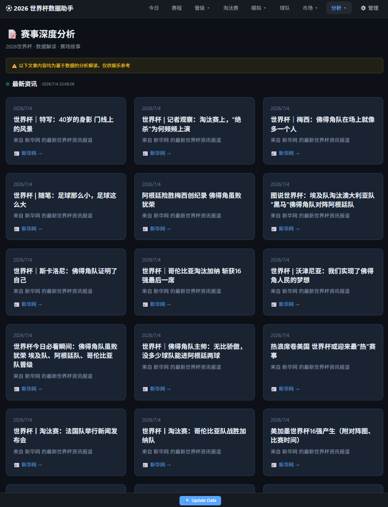

赛事深度分析专栏，包含：

- **最新资讯：** 从新华网等源聚合的最新世界杯新闻（页面顶部实时更新）
- **深度分析：** 原创分析文章，涵盖淘汰赛全景回顾、冷门解读、关键比赛战术剖析等
- **标签系统：** 按主题（球队、阶段、数据）分类

文章示例：32强全景回顾、16强开战日深度解析、淘汰赛冷门数据总结等。

---

## 🔗 Polymarket 预测市场

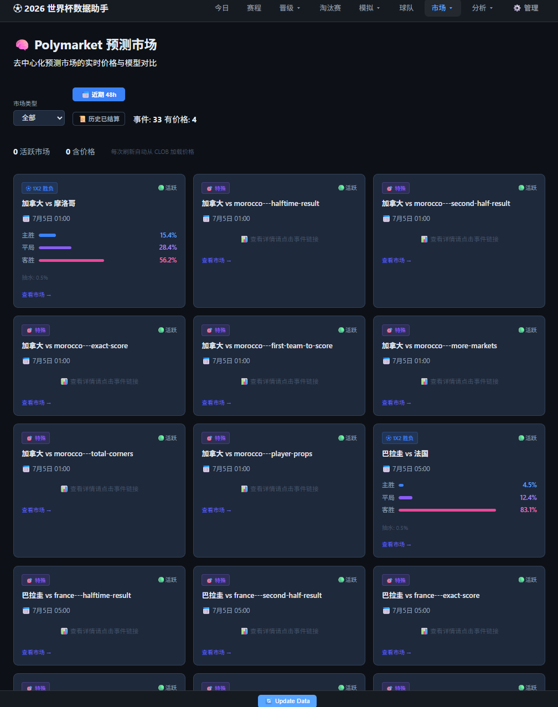

Polymarket 链上预测市场的实时数据：

- 各球队的夺冠合约价格
- 市场深度和流动性
- 与模型概率的对比分析

---

## 🔬 预测模型方法论

**页面：** `/methodology`

网站预测模型的技术说明文档，涵盖：

- **Elo 模型：** 基础评分系统，基于历史比赛权重计算
- **Poisson 分布：** 比分概率模型，量化各比分可能性
- **Dixon-Coles 修正：** 低比分偏差校正（低频比赛场景优化）
- **集成模型：** Elo + ML 的动态权重融合
- **Monte Carlo 模拟：** 10,000 次采样模拟淘汰赛各种可能路径
- **数据源说明：** 赔率数据、赛事数据来源

---

## 💹 赔率市场

**页面：** `/demo`

实时赔率对比面板，聚合多个数据源：

- **Fusion Odds：** 聚合赔率
- **交易所赔率：** Betfair 实时行情
- **各公司对比：** 主流赔率公司的赔率差异
- **价值投注：** 当模型预测概率与市场赔率出现偏差时的机会提示

---

## 🤖 在线学习

**页面：** `/online-learning`

模型在线自适应学习面板，展示：

- 模型参数的实时更新轨迹
- 在线学习 vs 静态模型的性能对比
- 学习曲线的可视化

---

## ⚙️ 管理面板

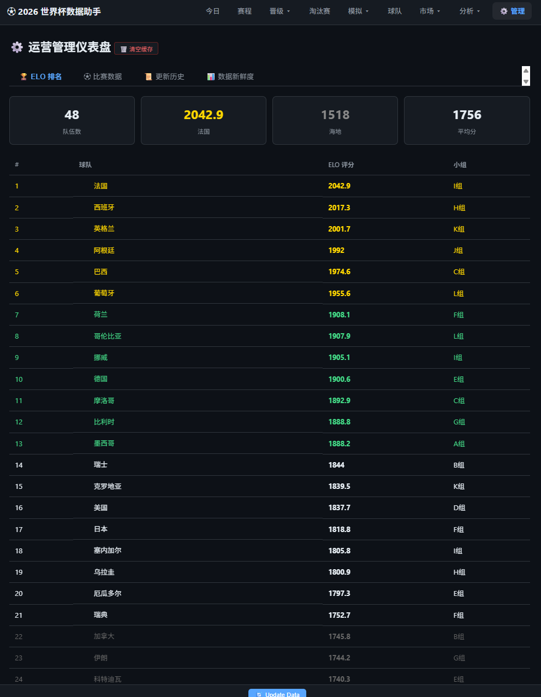

系统管理后台：

- ML 引擎状态（模型加载、版本、校准状态）
- 缓存统计与刷新
- 数据新鲜度检查
- 模型降级统计
- 预测引擎开关

---

## 🛠️ 技术栈

| 层 | 技术 |
|---|------|
| **前端** | EJS 模板 + 原生 JavaScript + CSS |
| **后端** | Node.js (Express) |
| **预测引擎** | Python (numpy, scipy, scikit-learn) |
| **AI 分析** | DeepSeek / Gemini API |
| **数据源** | Sporttery（竞彩网）、Polymarket API、ESPN |
| **部署** | Railway (Nixpacks) |

## 📄 许可

仅供娱乐参考，所有预测数据基于数学模型计算，不构成任何决策建议。
